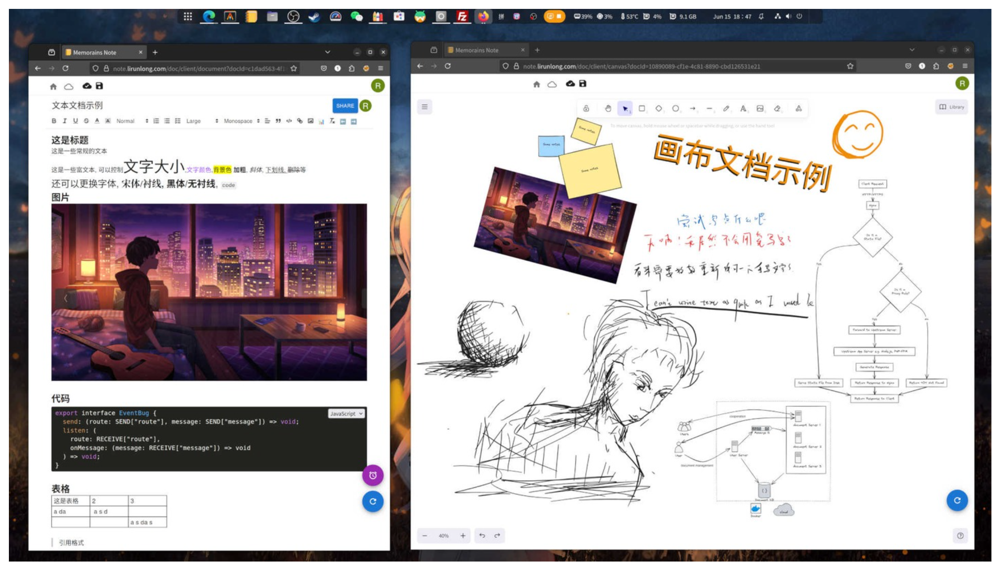

# Memorains Note

Memorains is a note application built on web technologies, integrating rich text editing canvas drawing. It supports both online and offline use, as well as multi - user and multi - device collaboration, greatly enhancing content creation and collaboration efficiency.

This project included code of client and server. With the help of this project, you can build your own controllable note-taking system.

Here is the [online demo](https://note.lirunlong.com/doc/client/).

## Current features
- Four types of note:
    - Rich text editor(Based on [quill](https://github.com/slab/quill))
    - Infinite canvas (Based on [excalidraw](https://github.com/excalidraw/excalidraw))
    - Todo list editor (Task management with deadlines and collaboration)
    - Chat note (Messenger-style real-time chat)
- Conflict free (Based on [yjs](https://github.com/yjs/yjs))
- Multi-devices/users collaboration
- Both online & offline supported
- Multiple platform client
    - Web browser
    - Desktop
        - Linux
        - Windows
        - Macos
    - Mobile devices
        - Android
        - IOS

## How to build and deploy

A single Docker image bundles all services (MariaDB + nginx + Node.js).

### One-command build (recommended)

```bash
cd script
bash build_web_package.sh
```

This builds the server, client, and Docker image, then exports to `script/out/memorains-image.tar.gz`.

### Manual build

```bash
# Build server
cd server && npm install && npm run build

# Build client
cd ../client && npm install && npm run build

# Build Docker image
cd ..
podman build -t memorains:latest .
```

### Prepare SSL certificate (optional, for HTTPS)

```bash
mkdir ~/certificate
# Place your cert.pem and cert.key into ~/certificate/
```

If you skip this, the container still works on HTTP (port 80) with HTTPS (port 443) disabled.

### Run

```bash
podman run -d \
  -p 80:80 \
  -p 443:443 \
  -v memorains-db:/var/lib/mysql \
  -v ~/certificate:/app/certificate \
  --name memorains \
  memorains:latest
```

The database and user are created automatically on first run. Tables are created by the server on startup.

### Open in the browser

Open `https://your-host/doc/client/` (or `http://your-host/doc/client/` without SSL).


## Others
### Third-party open source libraries
- [quill](https://github.com/slab/quill)
- [excalidraw](https://github.com/excalidraw/excalidraw)
- [material-ui](https://github.com/mui/material-ui)
- [yjs](https://github.com/yjs/yjs)

## Star History
[](https://www.star-history.com/#redTreeOnWall/memorains&type=date&legend=top-left)
