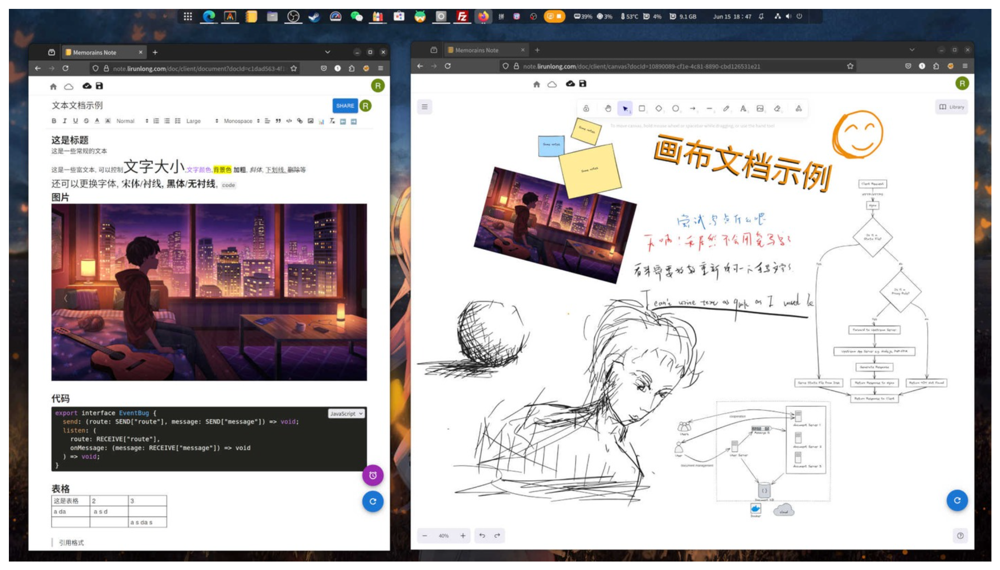

# Memorains Note

Memorains is a note application built on web technologies, integrating rich text editing canvas drawing. It supports both online and offline use, as well as multi - user and multi - device collaboration, greatly enhancing content creation and collaboration efficiency.

This project included code of client and server. With the help of this project, you can build your own controllable note-taking system.

Here is the [online demo](https://note.lirunlong.com/doc/client/).

## Current features
- Four built-in types of note:
    - Rich text editor(Based on [quill](https://github.com/slab/quill))
    - Infinite canvas (Based on [excalidraw](https://github.com/excalidraw/excalidraw))
    - Todo list editor (Task management with deadlines and collaboration)
    - Chat note (Messenger-style real-time chat)
- Document types are pluggable: each type is a self-contained folder under
  `client/src/doc-types/plugins/`, auto-discovered at build time, so adding a
  type needs no change to the router, menus or document list
- Conflict free (Based on [yjs](https://github.com/yjs/yjs))
- Multi-devices/users collaboration
- Both online & offline supported
- Multiple platform client
    - Web browser
    - Desktop
        - Linux
        - Windows
        - Macos
    - Mobile devices
        - Android
        - IOS

## How to build and deploy
### Build and upload application package
Install dependencies once (the client `postinstall` also copies the Excalidraw
assets into `public/`):
```
cd client
npm install
```

Build the deployable web package. Run this **from the `script/` directory** —
the scripts use `pwd`-relative paths and would otherwise write to the wrong
place. The script builds the client itself, so no separate `npm run build` is
needed:
```
cd script
bash build_web_package.sh
```
This produces `script/out/package.tar.gz` (client build + server + DB schema +
nginx config + docker-compose, with production dependencies pre-installed).
Upload that file to your server.

To also build the desktop and Android packages, run `bash build_all.sh` instead;
the extra artifacts land in the same `script/out/` directory.

### Prepare you SSL certificate
Create an folder named `certificate` in server's home path.
``` shell 
mkdir ~/certificate
```
Put your nginx SSL certificate into this folder.
```
# ls ~/certificate/
# cert.key  cert.pem
```

### Run application
Run the application use podman.
```
tar -zxvf package.tar.gz
cd package
podman compose up -d
```
you can also run this use `docker compose`.

The database schema is applied automatically on first start, so there is no
manual database setup step. If you use Docker rather than Podman, see the
resolver note at the top of `nginx.conf`.

### Open in the browser
Open link in the browser: https://$your-host/doc/client/


## Development
Start the dev servers (client on <http://localhost:5173>, server on :8000 with a
containerised MariaDB):
```
cd client && npm run dev
cd server && npm run dev
```
Then open <http://localhost:5173/doc/client/>.

See `AGENTS.md` for architecture notes and `client/src/doc-types/` for how to add
a document type.

## Others
### Third-party open source libraries
- [quill](https://github.com/slab/quill)
- [excalidraw](https://github.com/excalidraw/excalidraw)
- [material-ui](https://github.com/mui/material-ui)
- [yjs](https://github.com/yjs/yjs)

## Star History
[](https://www.star-history.com/#redTreeOnWall/memorains&type=date&legend=top-left)
